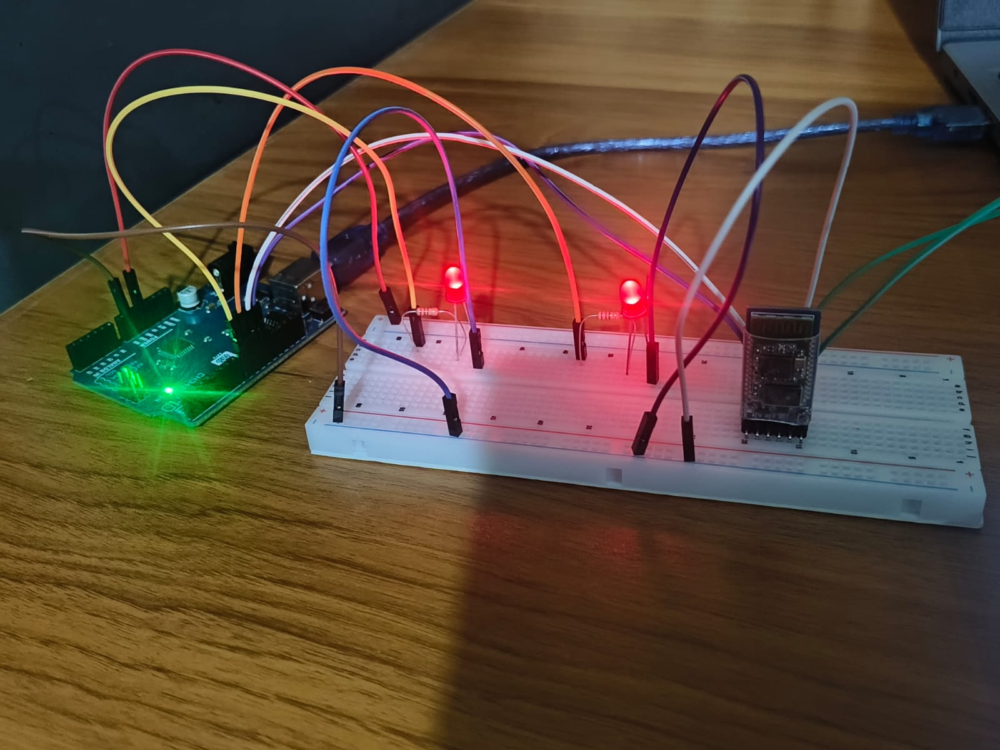
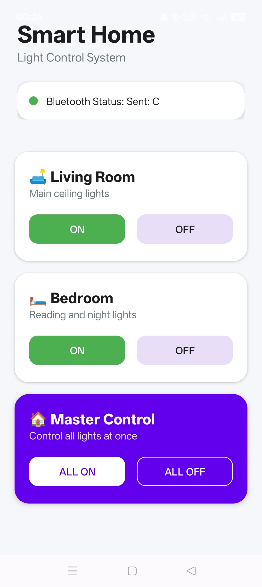
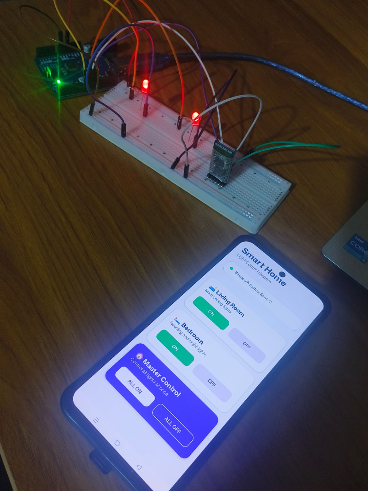

#  Smart Home Light Control System

An Android + Arduino based Smart Home automation system that allows users to control multiple lights wirelessly using Bluetooth (HC-05) and a custom Android application.

---

##  Project Overview

This project demonstrates a simple IoT-based home automation system where an Android application communicates with an Arduino board via Bluetooth to control electrical loads (LEDs representing lights).

The system is designed for beginners in embedded systems and Android development, combining both hardware and software integration.

---

##  Features

-  Android-based control interface
-  Bluetooth wireless communication (HC-05)
-  Control multiple lights (ON/OFF)
-  Separate room controls (Living Room, Bedroom)
-  Real-time response from Arduino
-  Simple and user-friendly UI

---

##  Hardware Components

- Arduino Uno
- HC-05 Bluetooth Module
- Breadboard
- LEDs (for simulation of lights)
- Resistors
- Jumper wires
- Power supply / USB cable

---

##  Software Used

- Android Studio (Java)
- Arduino IDE
- Bluetooth Serial Communication

---

##  Android App Features

- Clean UI with buttons for each room
- Bluetooth connection status display
- ON/OFF control for:
  - Living Room lights
  - Bedroom lights
  - All lights
- Sends simple character commands to Arduino

---

## 🔌 Bluetooth Commands Used

| Command | Function |
|--------|----------|
| A | Living Room ON |
| a | Living Room OFF |
| B | Bedroom ON |
| b | Bedroom OFF |
| C | All Lights ON |
| c | All Lights OFF |

---

##  Circuit Diagram

---

##  Project Structure
Smart-Home-Light-Control/
│
├── Android-App/
├── Arduino-Code/
│ └── SmartHomeLightControl.ino
├── Images/
│ ├── App/
│ ├── Hardware/
│ └── Circuit/
└── README.md

---

##  How It Works

1. Android app connects to HC-05 via Bluetooth
2. User presses ON/OFF buttons
3. App sends character commands (A, a, B, b, C, c)
4. Arduino receives commands
5. Arduino switches LEDs accordingly

---

##  Project Images

### App UI
- Home Screen
- Control Interface

### Hardware Setup
- Arduino + HC-05
- LED connections

---

##  Future Improvements

- Add voice control using Google Assistant
- Add real-time feedback from Arduino to app
- Expand to IoT cloud control
- Replace LEDs with real home appliances using relays

---
 
